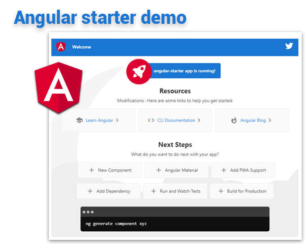
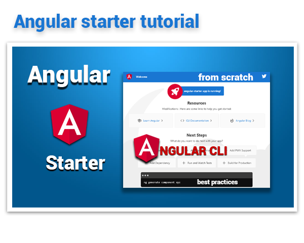

# Angular 10 Example Starter

<table>
<tr>
<td>
  <a href="https://www.ganatan.com/en">
    
  </a>

it's part of a repo series designed to create a **Web Application with Angular 10**


* Featuring [**Angular 10.0.14**](https://github.com/angular/angular/releases) & [**Angular CLI 10.0.8**](https://github.com/angular/angular-cli/releases/)


* See the [**Live demo**](#live-demo), Test the repo with [**Quick start**](#quick-start) and for more information Read the step by step [**Tutorial**](#tutorial) or read the [**Getting started**](#getting-started)

* And if you want to [**support**](#support)
:star: Star us on GitHub

</td>
</tr>
</table>


# [Support](#support)
[](https://github.com/ganatan/angular-example-starter)
[](https://github.com/ganatan/angular-example-starter/fork)

# [Live Demo](#live-demo)
Here is a working live demo :  https://demo.ganatan.com/angular-example-starter


<p align="center">
  <p align="center">
    <a href="https://demo.ganatan.com/angular-example-starter">
      
    </a>
  </p>
</p>


# [Quick start](#quick-start)

```bash
# clone the repo
git clone https://github.com/ganatan/angular-example-starter.git

# change directory
cd angular-example-starter

# install the repo with npm
npm install

# start the server
npm start

```
in your browser go to [http://localhost:4200](http://localhost:4200) 


# [Tutorial](#quick-start)

Here is a step by step Tutorial :  https://www.ganatan.com/tutorials/getting-started-with-angular

<p align="center">
  <a href="https://www.ganatan.com/tutorials/getting-started-with-angular">
    
  </a>
</p>

# [Getting started](#getting-started)


## Installation
* `npm install` (installing dependencies)
* `npm outdated` (verifying dependencies)

## Development
* `npm run start`
* in your browser go to [http://localhost:4200](http://localhost:4200) 

## Production 
* `npm run build`

### Use Chrome version 85 min !!!!

## Tests
* `npm run lint`
* `npm run test`
* `npm run e2e`

## Chrome Installation on Linux

sudo sh -c 'echo "deb [arch=amd64] https://dl.google.com/linux/chrome/deb/ stable main" > /etc/apt/sources.list.d/google-chrome.list'
wget -q -O - https://dl-ssl.google.com/linux/linux_signing_key.pub | sudo apt-key add -
sudo apt-get update
sudo apt-get install google-chrome-stable --yes


# [Author](#author)
* Updated : 27/08/2020
* Author  : danny

## [English Tutorials](#english-tutorials)
- Installation - https://www.ganatan.com/tutorials/getting-started-with-angular
- Tutorials Step by Step - https://www.ganatan.com/tutorials/en

## [Tutoriels en français](#french-tutorials)
- Installation - https://www.ganatan.com/tutorials/demarrer-avec-angular
- Tutoriels Etape par étape - https://www.ganatan.com/tutorials

